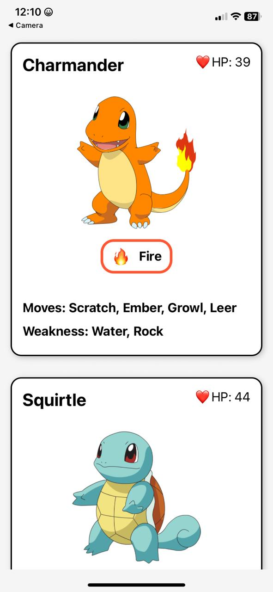
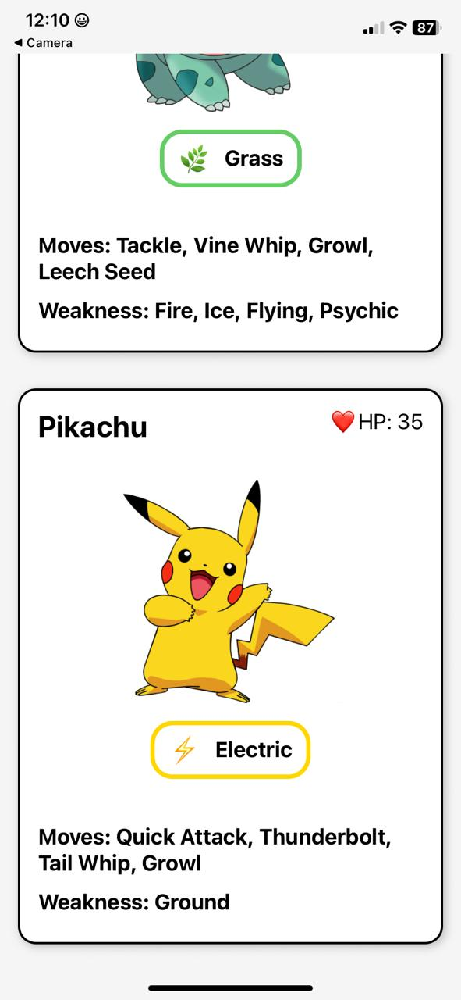

# Pokémon Card App

A simple React Native app displaying Pokémon cards.

<div align="center">
  
    
</div>

## Features
- Displays Charmander, Squirtle, Bulbasaur, and Pikachu cards
- Shows Pokémon stats: HP, type, moves, and weaknesses
- Clean mobile-friendly interface

## Setup
1. Clone the repository:
```bash
git clone https://github.com/KennedyGakuru/pokemoncard.git